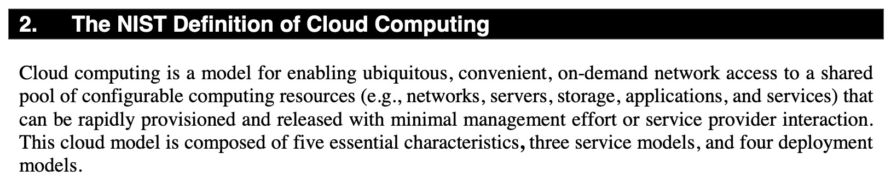

01.Cloud Computing

## 01\. 클라우드 컴퓨팅(Cloud Computing)

### 01\. 클라우드 컴퓨팅이란?

최근 10여동안 클라우드 컴퓨팅(또는 클라우드)이라는 용어가 IT 전 영역에 화두로 떠 올랐고 상업적 분야뿐만아니라 IT 기술 분야에서도 큰 인기를 누리고 있다.
상업적인 접근을 배제하고 기술적인 의미로만 생각해 본다면 IT 자원에 대한 공급과 소비에 대한 하나의 모델을 지칭하는 용어라 볼 수 있다.
클라우드라는 단어는 공급과 소비의 대상이 되는 IT 자원의 추상화에 대한 은유적 표현이라 볼 수 있다.
미국 국립 표준 기술 협회(National Institute of Standard and Technology, NIST)의 공식 정의는 다음과 같다.



```
클라우드 컴퓨팅이란 소비자가 최소의 관리 노력과 공급자와의 최소의 상호작용으로 신속한 사용과 해제가 가능한 컴퓨팅 자원(서버, 스토리지, 네트워크, 애플리케이션)들을
공유풀에 두고 네트워크를 통해서 언제 어디서나 접근 가능하게 하는 모델이다.
```

이 정의에서 언급하는 IT 자원들 즉, 클라우드의 추상화 수준은 가상 하드웨어서 복잡한 분산 시스템까지 다양하다.
AWS는 클라우드 컴퓨팅 모델을 기반으로 한 서비스로 다양하고 엄청난 양의 자원을 사용자가 원하는 즉시 사용할 수 있도록 프로비저닝(provisioning)한다.
사용한 만큼 비용을 지불한다.

### 02\. 유형(Types)
클라우드는 보통 아래와 같이 3가지의 유형으로 구분한다. AWS은 공용(Public) 클라우드 이다.

01. 공용(public)
    클라우드 컴퓨팅을 특정 조직이 구성하고 관리한다. 그리고 이 환경을 서비스 형태로 사용자에게 공개한다. 즉 개방된 클라우드다.
    
02. 사설(private)
    클라우드 컴퓨팅을 특정 조직이 구성하는 것은 public과 같지만 조직 내의 IT 인프라에만 적용한 것이다.
    
03. 하이브리드(hybrid)
    public과 private을 혼합한 클라우드를 지칭한다.

아마존닷컴은 온라인 서점으로 시작하여 현재는 세계최대의 온라인 쇼핑몰 업체이다. 사용자도 엄청난데, 크리스마스나 미국 블랙프라이데이(추수감사절) 시즌에는 단기간에 사용자가 폭증한다.(블랙 프라이데이는 미국 연간 소비의 20%를 차지한다고 한다) 그리고 이 시준이 끝나면 다시 평소대로 돌아 온다.

여기서 단기간에 서버를 늘리고 사용하지 않는 서버는 다른 곳에 사용하는 클라우드 기술은 아마존닷컴이 필요로 하던 기술이었고 개빨 후 자사에 활용하고 이 후, 퍼블릭 서비스로 공개된 것이 AWS이다.

그렇기 때문에 이 후에 더시 정리하겠지만 AWS에서 제공하는 많은 리소스(서비스)들은 아마존닷컴의 필요에 의해 개발된 것이 많다.
1. 쇼핑몰에서 사용하는 엄청난 양의 제품 사진 이미지 파일들의 저장하고 빠르게 전송할 수 있는: S3, CloudFront
2. 정확한 결제와 실시간 배송처리를 위한: SQS
3. 많고 복잡한 데이터 저장을 위한: RDS, DynamoDB
4. 구매 패턴 분석을 위한 빅데이터 플랫폼: Data Pipline, Elastic Map Reduce 등이다.


### 03\. 분류(Classifications)
​ 또한, 아래의 3가지 정도로 분류될 수 있으며 AWS는 IaaS, Pass, SaaS 이 세 가지 분류 모두를 포함하는 것으로 볼 수 있다.

01. 인프라 서비스(Infrastructure as a Service, IaaS)
    가상 서버를 이용하여 컴퓨팅, 스토리지, 네트워킹 등과 같은 기본적인 자원을 제공한다.
    예) AWS EC2, Google Compute Engine, MS Azure Virtual Machine
    
02. 플랫폼 서비스(Platform as a Service, PaaS)
    클라우드에 사용자가 개발한 애플리케이션을 배포및 실행 환경을 제공한다.
    예) AWS Elastic Beanstalk, Google App Engine, Heroku
    
03. 소프트웨어 서비스(Software as a Service, SaaS)
    클라우드에서 실행되는 소프트웨어
    예) AWS Workspace, Google Docs, MS Office 365
    

