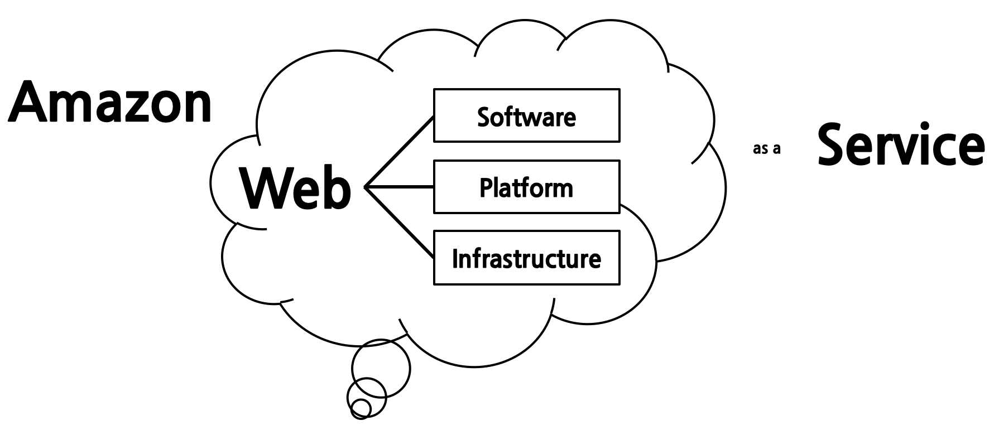

02.Amazon Web Service

## 02\. 아마존 웹 서비스(Amazon Web Service)

### 01\. 클라우드 컴퓨팅 서비스(Cloud Computing Service)

​ 아마존 웹 서비스는 공용 클라우드 서비스이다. 웹 서비스 또는 기업용 애플리케이션이 실행되고 많은 양의 데이터를 관리하기 위한 컴퓨팅, 스토리지, 네트워크, 플랫폼, 소프트웨어 등의 다양한 자원을 제공하는 클라우드 서비스이다.    

### 02\. 장점(Benefits)
​ 클라우드 컴퓨팅을 사용할 때 가장 큰 장점을 꼽으라면 일반적으로 비용 절감을 우선 꼽는다. 하지만 클라우드 컴퓨팅 사용의 장점이 경제적인 부분만 있는 것은 아니다. 다음과 같은 일반적인 장점들을 더 생각해 볼 수 있다.

01. 자동화(Automation)
02. 확장성(Scalability, Flexible Capability)
03. 신뢰성(Reliability, Failover)
04. 시간단축(Agility)
05. 규모의 경제(Economy of Scale)
06. 국제화(Worldwide)
07. 표준화(Standardization)