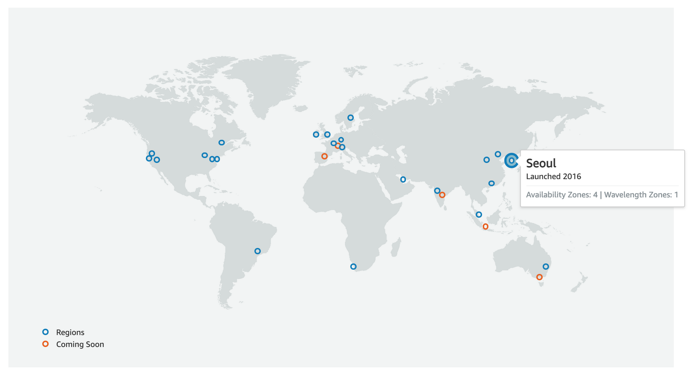
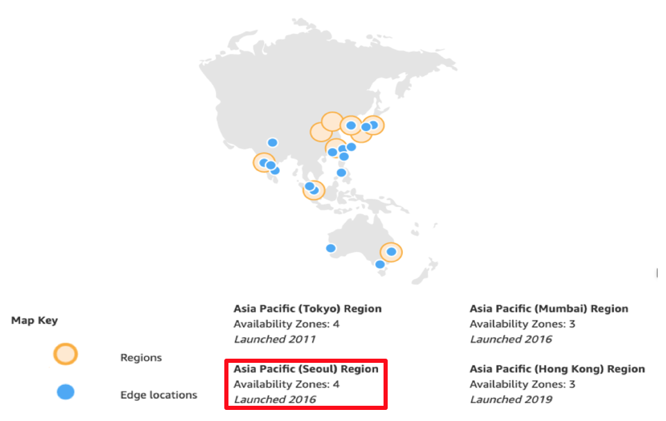

03. Conceptual Basics

## 03\. 기본 개념(Conceptual Basics)
​ AWS의 가장 기초적이고 기본적인 개념이라 할 수 있는 리전(Region, 지역), 가용영역(Availability Zone, AZ), 에지 로케이션(Edge Location)에 대한 개념을 설명한다. 클라우드 컴퓨팅은 가상화 기술을 기반으로 하고 있다. 가상화는 소트웨어로 구현되지만 '실제 하드웨어 서버(Bare Metal Server)'가 필요하다.

​ AWS는 1,400만 대의 실제 서버를 운영하는 것으로 알려져 있는데 물리적으로 한 공간에 있는 것이 아니다. 전 세계에 흩어져 있는 실제 서버에서 작동하는 가상 서버들에서 인프라 자원들의 서비스가 제공되는 클라우드라 볼 수 있다. 따라서 전 세계가 대상인 서비스이기 때문에 자신의 서비스 대상에 따라 인프라 자원의 위치를 알아야 하는데 이 때 자주 접하게 되는 기본적인 용어들을 소개한다.

### 01. 리전(Region)
​ AWS의 서비스가 위치하고 있는 물리적 위치를 가리키는 용어다. 전 세계 주요 지역에 위치하고 있으며 현재(2020년 기준) 25개가 있다. 리전에는 가용영역(AZ)이 여러개 있는데, 가용영역이 우리가 흔히 말하는 데이터센터(IDC)가 되며 가용 영역의 클러스터(cluster)가 리전이다. 리전이 여러 곳에 있는 이유는 물리적인 네트워크 속도와 천재지변에 대비하기 위해서이다.
​ 다음 그림은 전 세계에 위치한 리전을 보여준다. 총 25개가 있으며 앞으로 15개 리전을 더 늘릴 계획이라 한다.

### 02. 가용영역(Availability Zone)
​ 우리가 흔히 말하는 데이터 센터이다. 리전에 위치하는 서비스의 높은 가용성(High Availability)을 위해 여러 논리적 클러스터 그룹으로 구성되기 때문에 가용 영역이라 부른다. 현재(2020년) AWS는 80개 가용 영역을 두고 있으며 그림에서 우리나라는 4개의 가용 영역이 있음을 알 수 있다. 

### 03. 에지 로케이션(Edge Location)
​ AWS CDN(Content Delivery Network) 서비스인 CloudFront를 위한 캐시 서버를 뜻한다. CDN 서비스는 웹 서비스의 콘텐츠(HTML, 이미지, 동영상 등의 정적 자원)를 빠르게 전달하기 위해 여러 캐시 서버에 원본을 복제하는 서비스이다. AWS도 CloudFront 서비의 캐시를 위해 전 세계 주요 도시에 Edge Location이라 부르는 캐시 서버를 구축해 놓고 있다.  

