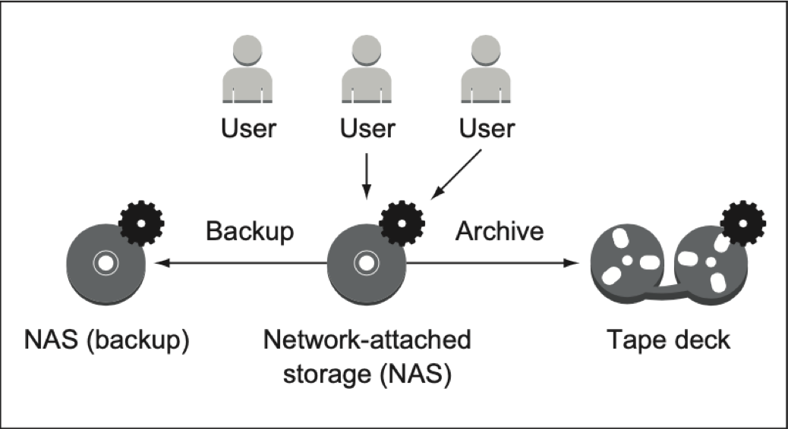
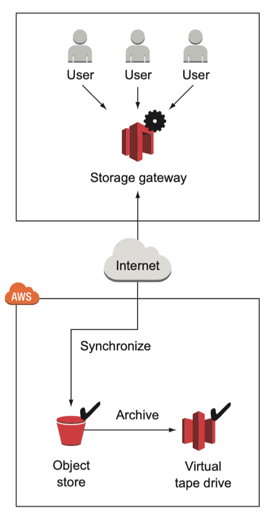
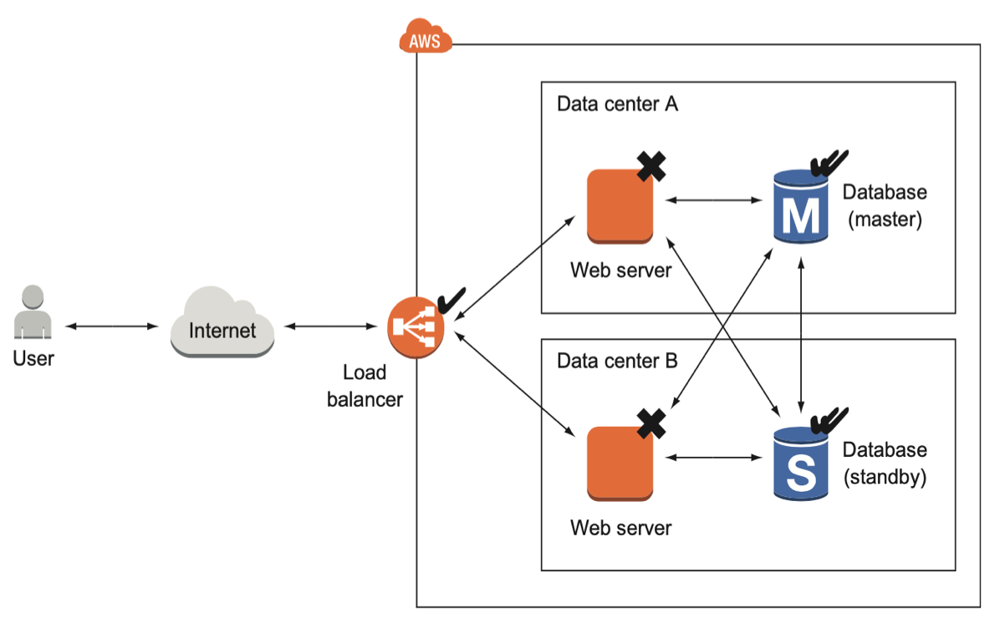

04. AWS Examples

## 04\. 활용 사례(AWS Examples)

### 01\. 실제 사례

1.  단기간에 많은 서버가 필요하고 이벤트 이 후에는 필요가 없을 때: 화성 탐사 로버 큐리오시티(Mars Curiosity Rover)
    NASA의 화성탐사로버 큐리오시티 화성 착륙 장면의 인터넷 중계했다.
    7분이었지만 중요한 이벤트였기 때문에 많은 사람들의 시청 수요를 예측하기가 어려웠다.
    그렇다고 여유있게 많은 서버를 준비하면 고작 7분 때문에 드는 비용과 시간과 노력은 엄청났을 것이다.
    하지만 NASA는 EC2(가상 서버), Route53(DNS Service), CloudFront(CDN 콘텐츠 배포), CloudFormation(인프라 구축 자동화), 로드 밸러스를 통한 분산 을 위해 ELB(Auto Scaling) 등의 AWS 인프라 자원을 활용하여 성공적으로 중계를 마쳤다.
    
2.  자체 IT 인프라를 직접 구축하지 않고 비즈니스와 서비스 개발/운영에 집중: 넷플릭스(Netflix)
    넷플릭스는 알다시피 전세계를 대상으로 DVD 온라인 대여와 스트리밍 서비스를 하는 회사다.
    처음에는 자체 IDC에서 On Premise로 인프라를 구축 운영했지만 점점 많아지는 사용자로 큰 문제를 겪었다.
    결국에는 서비스의 품질과 스트리밍의 가용성을 위해 컴퓨팅을 비롯하여 데이터베이스(RDS, DynamoDB), 분석/추천 엔진(AWS AI ML/DL), 비디오 트랜스 코딩(Elastic Transcoder), 스토리지(S3), 콘텐츠 배포(CloudFront) 등 10만여 개 인스턴스를 운영 중이다.
    
3.  며칠 만에 사용자가 폭증하는 경우(스타트업): 애니모토(Animoto)
    사진을 동여상으로 만들어 주는 서비스이다.
    평상시에는 40여개의 인스턴스로 운영하다가 페이스북 연동과 테크크런치 소개되면서 3일만에 75만 사용자가 늘어나면서 급격히 트래픽이 늘어났다.
    1시간에 최고 2500명의 사용자가 사용하는 상황이 발생허면 5000여개의 인스턴스로 생성되어 대응하고 있다.
    
4.  급격히 증가하는 글로벌 사용자에 대응(대기업, 국내): 아모레 퍼시픽(Amore Pacific)
    국내 화장품 회사인 아모레페시픽은 국내 IDC의 서버 호스팅(코로케이션) 기반하여 IT 인프라를 운영하고 있었다.
    글로벌 시장의 급성장으로 해외 사원 수가 많아지면서 서버 사용량이 급증했다.
    국내처럼 해외 현지 IDC 기반 온프레미스 운영도 고려했지만 초기 비용의 부담 지속적인 운영비 예상되어 AWS를 활용하여 클로벌 서비스를 제공하고 있다.
    여기서도 EC2(가상 서버), Route53(DNS Service), 스토리지(S3), 콘텐츠 배포(CloudFront) 등 글로벌 서비스를 제공하는 데 많이 사용되는 AWS 서비스들의
    적용 사례다.
    
5.  사용자 수를 예측하기 어렵고 하루 동안 사용량의 변화가 급변하는 경우(스타트업, 국내): 쿠키런 모바일 게임
    마찬가지로, 모바일 게임의 흥행 여부는 불확실하기 때문에 초기 IT 인프라에 대한 예측은 어렵고 부담스럽다.
    또한 성공했을 경우에는 국내뿐만 아니라 글로벌 시장도 고려해야 하는 상황이다.(우리나라를 비롯하여 전세계 가입자가 5000만)
    성공했을 경우 폭발적 사용자 증가에 대응하기 위해 AWS의 스케일 아웃(Scale out, 수평 확장)으로 대응하였고
    전 셰계에 있는 AWS의 IDC 때문에 글로벌 서비스 대응도 가능하다.
    

* * *

*스타트업과 클라우드 궁합*

1.  소수의 인원 -\> 혼자서 모든 인프라를 구축/관리가 가능
2.  자금 문제 -\> 초기 비용에 부담이 없고 사용한 만큼 지불
3.  실패할 가능성 -\> 인프라 삭제가 용이
4.  성공했을 경우 사용자 폭증 -\> 서버 증설과 부하 분산이 용이하기 때문에 신속히 대응 가능

### 02\. 할 수 있는 것들

앞의 구체적 사례를 기반으로 AWS가 할 수 있는 것들을 다시 예를 들어 설명한다.

1. 인터넷 쇼핑몰 운영
   인터넷 쇼핑몰 뿐만 아니라 인터넷 기반의 웹 서비스는 빠르고 안정적인 서비스를 유지하는 것이 보통 목표일 것이다.
   On Premise로 운영중인 쇼핑몰을 사례로 AWS의 클라우드 서비스 기반으로 변경할 경우 이 목표가 어떻게 달성되는 지 검토해 보자.
    
   다음은 온프레미스와 AWS에서의 쇼핑몰 운영에 대한 비교이다.
   
    
   on-premises 기반으로 쇼핑몰을 운영하기 위해서는 IDC에 서버를 임대해야 하고 사용자 요청을 처리하는 웹서버와 제품 정보와 주문 정보등의 데이터를 저장하는 데이터베이스도 운영해야한다. 그리고 지속적인 업데이트와 모니터링등 관리가 필요하다.
   AWS 클라우드 기반으로 쇼핑몰을 운영하면 웹서버에 대한 최소한의 업데이트와 모니터링만 필요할 뿐이고 데이터베이스에 다한 유지보수는 필요가 없다.
    
   더 구체적인 AWS 기반 쇼핑몰의 시스템 구성도를 살펴보자.    
   
	
   - 쇼핑몰의 동적 콘텐츠와 정적 콘텐츠로 분리하고 정적 콘텐츠를 CDN 서비스인 CloudFront로 제고함으로 웹 서버의 부하를 줄였다.
   - 데이터베이스, 객체스토어, DNS 서비스를 AWS에서 유지보수 없이 사용할 수 있다. - 운용비 절감
   - 쇼핑몰 애플리케이션이 실행되는 웹 서버는 가상 서버에서 운영된다. 만일 온프레미스에서 충분한 용량으로 서버를 준비하였다면 AWS에서는 분할하여 여러 대의 가상서버로 추가하여 분할할 수 있으며 로드 밸런스로 가용성을 확보할 수 있는 장점이 있다. 물론 이 부분도 유지보수가 필요없다.
	
2. 데이터 보관 요구 사항
   기업들은 사내에 많은 문서들을 공유해야 한다. 따라서 이런 공유 문서들을 관리하는 파일 서버를 운영하고 있다.
   이와 같은 파일 서버에 요구되는 것(요구사항)은 신뢰성 있고 내구성 있는 방식으로 데이터를 보관하는 것이다.
   
   다음은 보통 생각할 수 있는 NAS 기반의 사내 파일 서버 구성도이며 생각해 볼 수 있는 문제점은 다음과 같다.
   
   
   1. 사내 문서를 저장할 주 NAS가 필요하다. 백업을 고려해야 하기 때문에 같은 백업용 NAS도 준비하고 다른 네트워크에 연결해야 한다(파일 서버용 장비 이중 구매)
   2. 백업 서버가 한 건물에 있다면 화재나 침입으로 부터 취약하다.
   3. 비즈니스 데이터 보관 요구사항으로 오래된 데이터는 장기간 저장해야 한다. 이를 위해 테이프 덱과 같은 장비가 추가로 필요하다.
   4. 하나 더 남은 문제는 역시 파일 서버 시스템에 유지 보수(관리, 모니터링)가 필요하다.
   
   다음은 AWS 기반 파일 서버 운영에 대한 구성도이다.
   
   
   1. 객체 스토어(s3) 서비스는 서비스 자체가 수천 대 이상의 고가용성(HA) 웹 서버이기 때문에 가용성은 걱정할 필요가 없다.
   2. 스토리지를 이용하여 AWS 스토리지에 저장하기 때문에 NAS와 같은 장비는 더 이상 필요없다.
   3. S3 서비스는 가상 테이프 생성부터 저장까지 지원해준다. 
   
4. 무정지 장애 허용 시스템(Fault Tolerant System)
   AWS에서는 장애 허용 시스템 구축을 위한 기능을 제공하고 있다. 다음 구성도에 그 사례를 생각해 보자.
   
   
   1. 데이터베이스 장애를 위해 AWS RDS는 Master, Slave 구성의 복제/동기화 기능과 장애 조치(Failover) 기능을 제공한다.
   3. 웹 서버는 가상 서버에서 작동하는데 기본적으로 장애 허용 기능이 없다.
   4. 하지만, 고가용성을 위한 로드밸런서(ELB)을 통해 여러 IDC에 분산 실행 시켜 장애 허용을 달성할 수 있다.    