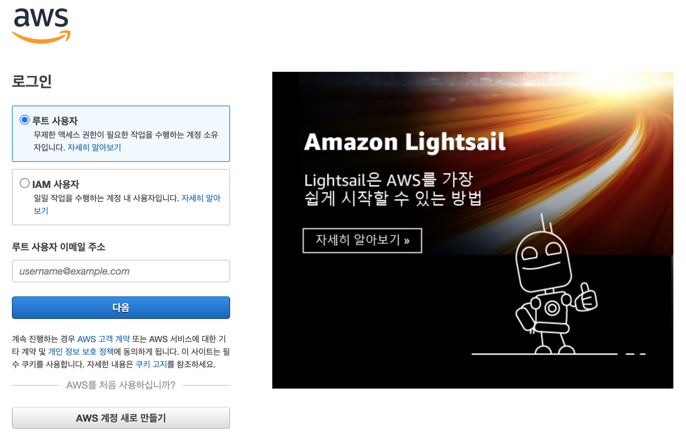
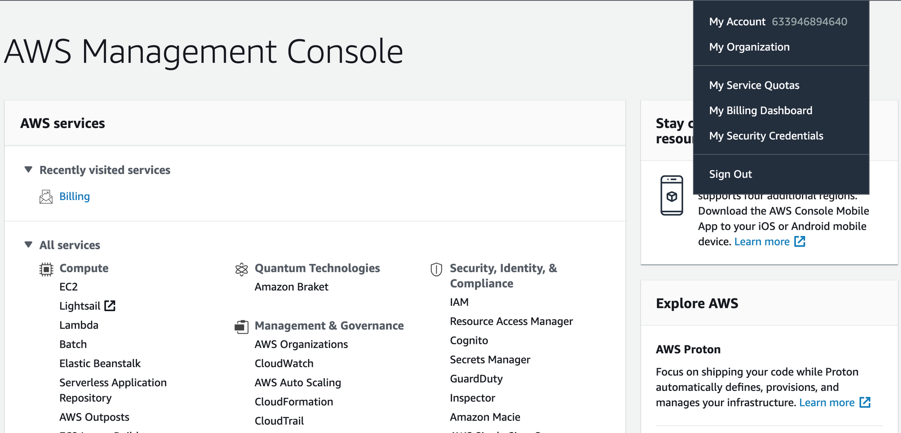
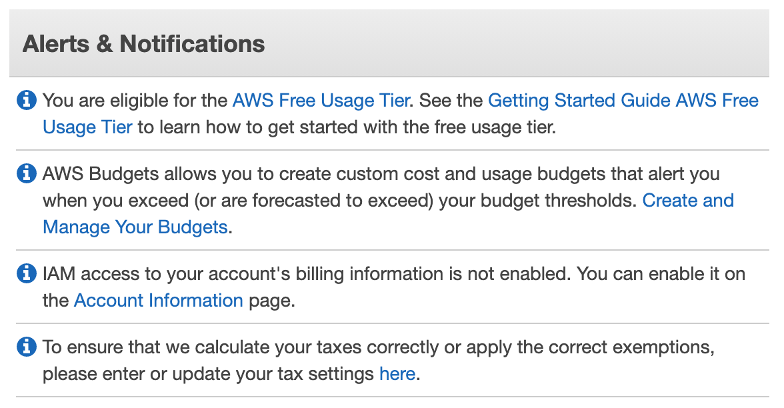

01. AWS Account

## 01\. AWS 계정

### 01. AWS는 기본적으로 유료 서비스이기 때문에 계정을 생성해야 한다.
### 02. 만일 하나의 계정으로 여러 사용자가 사용해야 한다면 IAM으로 계정에 그룹 생성이 가능하며 접근 제어및 권한 관리가 가능하다.
### 03. 기본적으로 AWS 계정은 하나의 Root 사용자가 된다.
### 04. 프리티어(Free Tier) 
- 생성(가입)후 1년 동안 주요 AWS 리소스를 제한된 범위에서 무료로 사용할 수 있다.
- 기존 가입 계정 프리 티어 확인하기

	01. 로그인 하기
		

	02. AWS Management Console 화면에서 My Billing Dashboard 선택
        
	
	03. Billing & Cost Management Dashboard 에서 Alerts & Notifications 내용 확인
        

		```
		You are eligible for the AWS Free Usage Tier
		```
		
		로 현재 프로티어 기간임을 알 수 있다. 프리 티어 기간이라도 제한된 범위을 넘어가면 과금이 된다. 따라서 실습 또는 테스트 용으로 사용 계획이라면 주의해야 한다.


