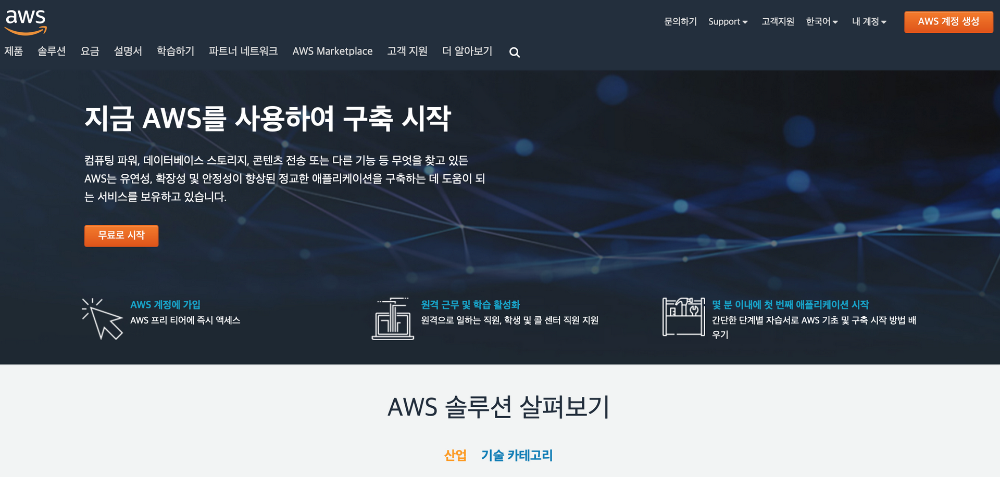
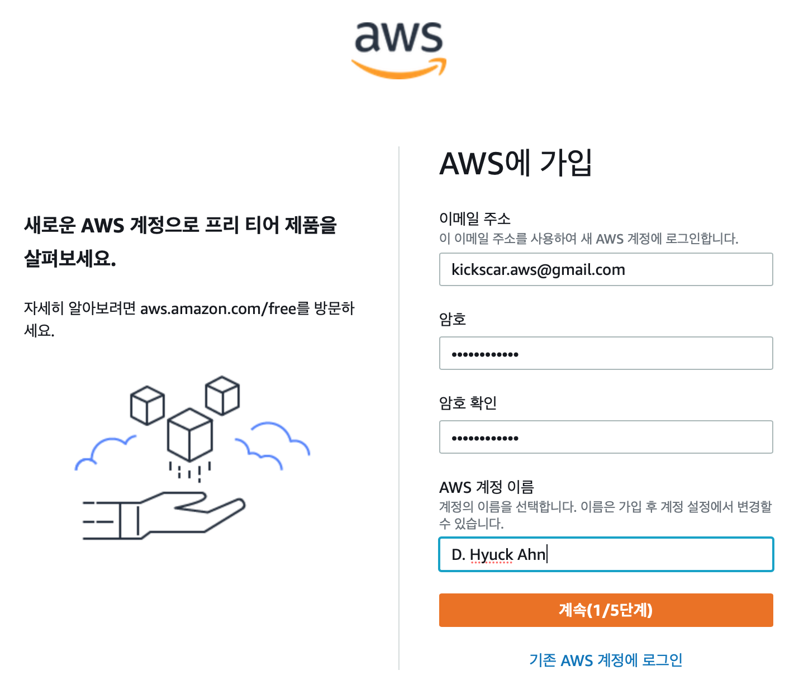
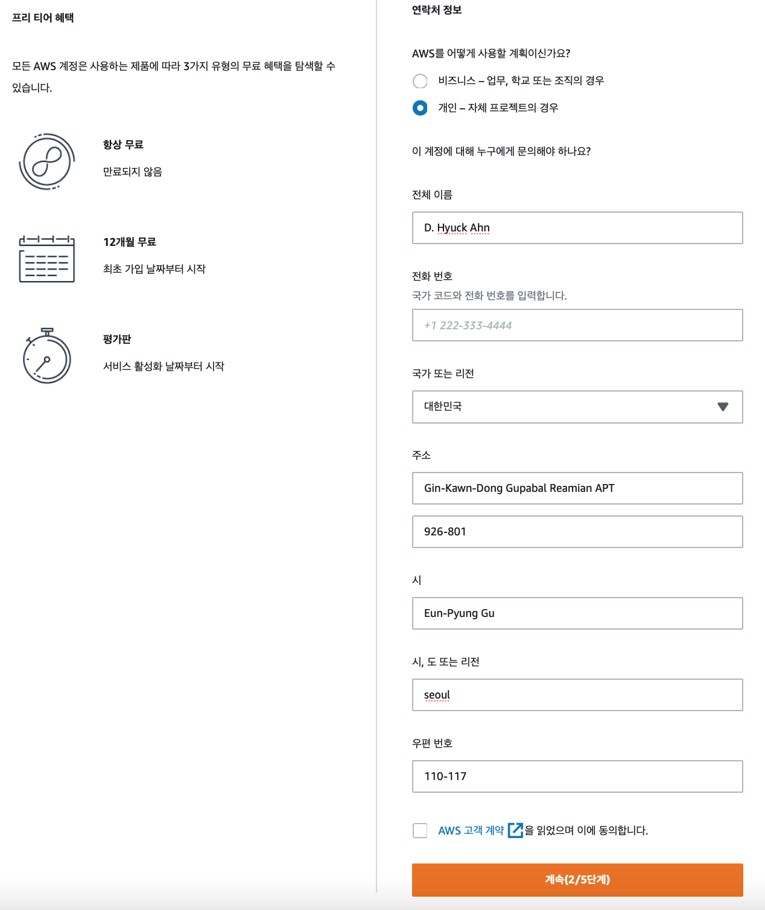
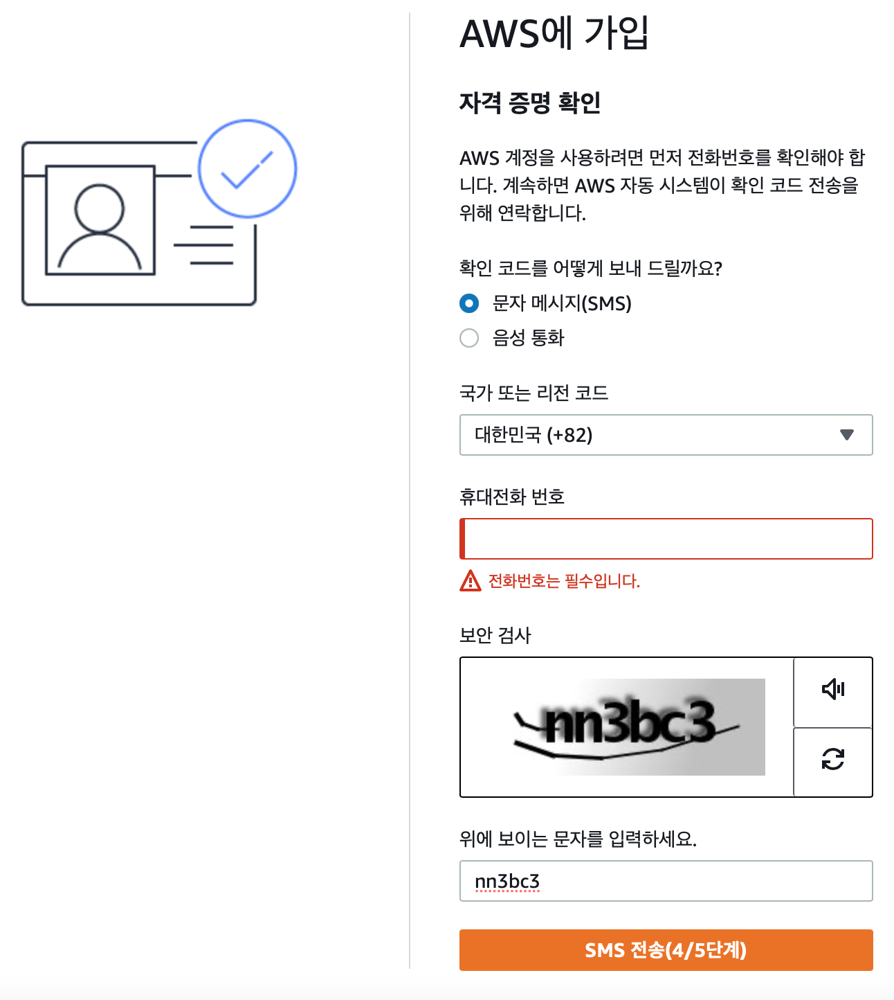
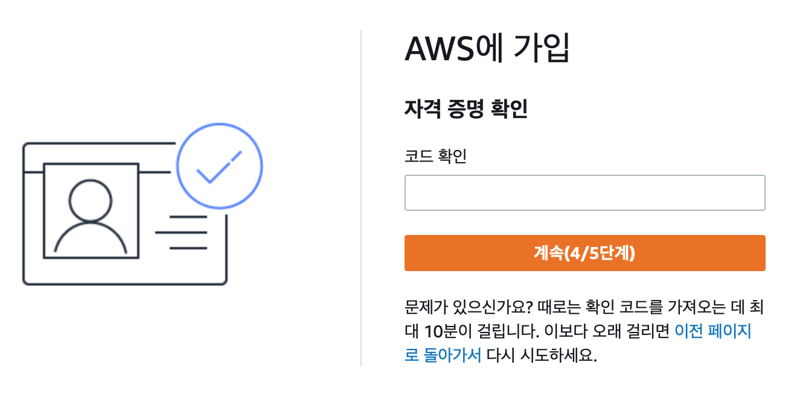
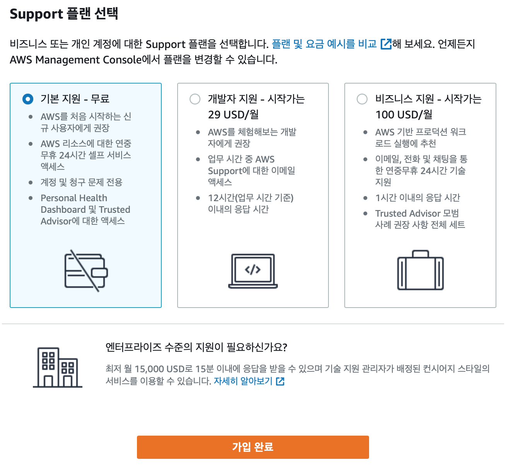
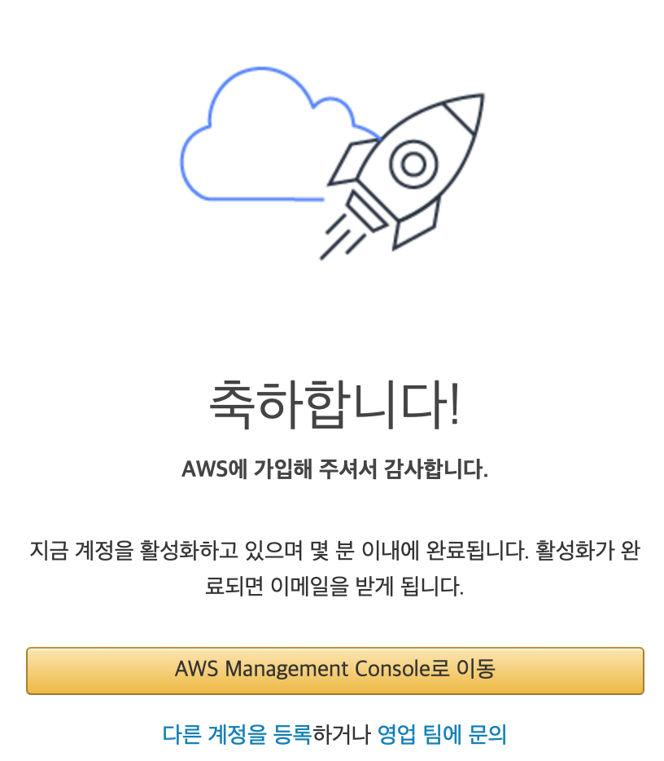

02. AWS 계정 생성(가입)

## 02. AWS 계정 생성(가입)
​ AWS 계정이 프리 티어 기간이 만료 되었거나 처음 AWS를 사용하면, 다음 과정을 참고하여 새 계정을 생성(가입)한다.

### 01. 계정 생성을 위해 필요한 것
- 신원 확인을 위한 전화번호
- 요금을 청구할 신용카드

### 02. 가입 절차
​ AWS 계정을 생성하기 위한 절차는 다음 5단계 이다.
01. 로그인 자격 증명 제공
02. 연락처 정보 제공
03. 결제 세부 정보 제공
04. 자각 증명 확인
05. 계획 지원 선택 

### 02. AWS 계정 생성
​ AWS 홈페이지(https://aws.amazon.com/ko/) 이동 한 후, 'AWS 계정 생성', '무료로 시작' 버튼을 눌러 가입을 시작한다.

    
01. 로그인 자격 증명 제공
    
    - 이메일 주소, 비밀번호, 계정 이름 입력
	- 계속 버튼을 눌러 다음 단계 진행

02. 연락처 정보 제공
    
    - 연락처 정보를 영문으로 모두 기입하여야 한다.
    - 계속 버튼을 눌러 다음 단계 진행

03. 결제 정보 입력
    
    - 확인 및 계속 버튼을 눌러 다음 단계를 진행
    
04. 자격 증명 확인    
    01 SMS 전송과 음성 통화를 통해 본인 인증을 진행할 수 있다.
  	   
    02 SMS로 전달 받은 Code를 입력하고 계속을 눌러 마지막 단계를 진행 한다.
       
        
05. 기술 지원 종류 선택
    
    - 기본 지원(무료)를 선택한다.
    - 가입 완료 버튼을 눌러 가입을 완료한다.
    
06. 가입 완료
    
