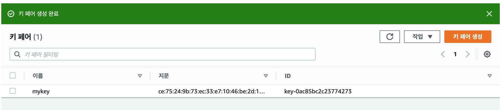

04. AWS 계정 Key Pair

## 04. AWS 계정 Key Pair

### 01. 키페어(Key Pair)
​ AWS EC2(가상 서버)에 접근하기 위해서 SSH 프로토콜 접근을 하게 된다. SSH 서버는 다양한 방법으로 SSH 클라이언트(보통 터미널 프로그램 Putty, Xshell 등)을 인증할 수 있다. 가장 기본적인 방법은 패스워드를 사용하는 방법이지만 가장 안전하지 못한 방법으로 비록 패스워드는 암호화되어 서버로 보내지지만 꾸준하고 반복적인 해커의 공격에 안전할만큼 복잡하거나 길지 않은 경우가 거의 대부분이다. 컴퓨팅 파워가 비약적으로 발전했기 때문에 자동화 된 스크립트를 사용한 brute-force 공격에 취약할 수 밖에 없다. 다른 추가적인 보안방식들도 있지만 SSH key가 가장 안정적이고 안전한 검증된 인증방식이다.
​ SSH 키 페어는 두 개의 암호키로 SSH 서버가 클라이언트를 인증하는데 사용될 수 있다. 키페어는 public 키와 private 키로 이루어지며 AWS 관리 콘솔에서 미리 생성해 두었다가 SSH로 로그인하길 원하는 EC2(가상 서버)에 Public 키를 저장한다. 그리고 클라이언트가 SSH key를 사용해 인증하려고 시도하면, 서버는 클라이언트가 private 키를 가지고 있는지 여부를 테스트 할 수 있다. 클라이언트가 private 키를 가지고 있는걸 증명하면 쉘 세션이 생성된다. 따라서 생성된 키페어의 private 키는 잘 저장하고 절대로 노출되거나 분실하면 안된다.

### 02. 키페어(Key Pair) 생성하기
01. 관리 콘솔에서 서비스 중에 EC2를 선택하여 EC2 관리 콘솔을 연다.
	

02. 왼쪽 네트워크및 보안(Network & Security) 메뉴에서 키 페어(Key Pair) 메뉴를 선택한다.
	

03. 키 페어 생성(Create Key Pair) 버튼 클릭
	

04. 키 페어 생성
	

05. 성공적으로 생성된 모습
	

​ 다운 받은 mykey.pem를 잘 보관해 두어야 한다. 'ch04 가상 서버:EC2'에서 클라이언트 설정 방법을 언급한다.
