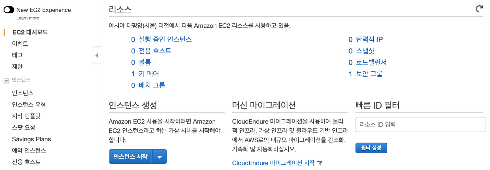
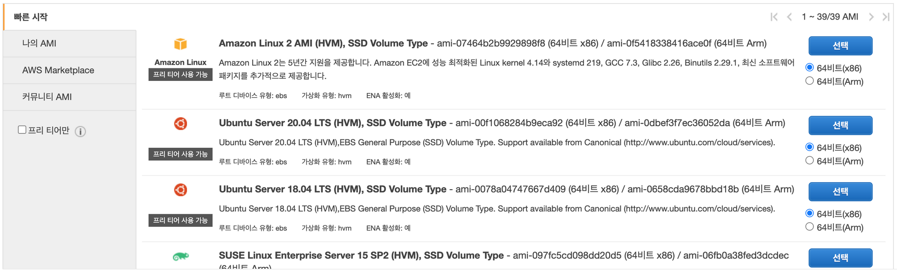
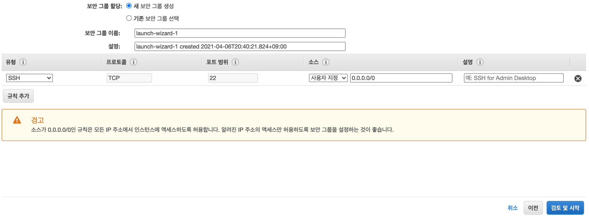
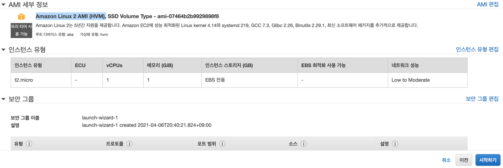
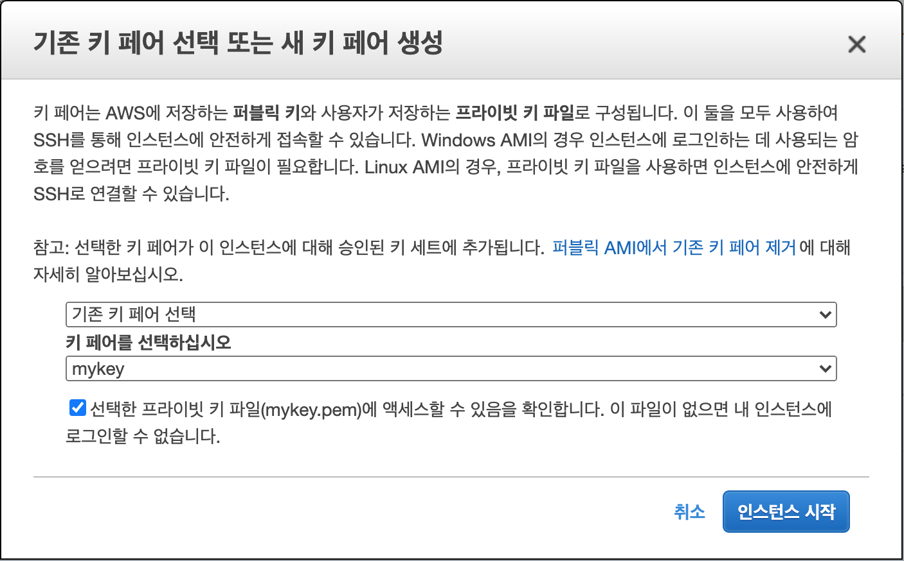
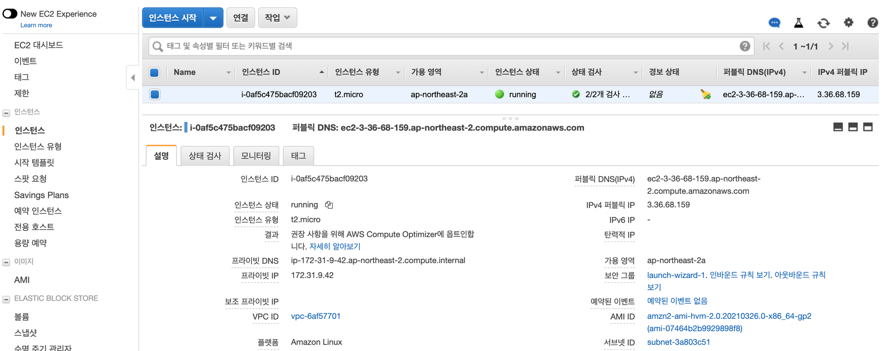

02. Launching Virtual Server

## 02\. 가상 서버 시작

### 01\. 마법사 시작
​ AWS에서 가상서버를 시작하기 위해서는 서비스에서 EC2를 선택하여 EC2 대시보드에서 인스턴스 시작(Lauch Instance) 으로 마법사를 시작한다. 다음 단계로 마법사를 실행한다.

01.  관리 콘솔 열기(https://console.aws.amazon.com)
02.  리전(Region) 확인하기
03.  탐색바(Navigation Bar)의 서비스에서 'EC2' 선택하여 'EC2 대시보드(Dashboard)'로 이동
04.  '인스턴스 시작(Launch Instance)' 버튼 클릭

### 02\. 마법사 단계
​ 마법사는 다음 단계에 따라 진행된다.
01. AMI 선택: 1단계
    자신에게 맞는 OS와 소프웨어 등이 설치된 AMI를 선택한다. 프리티어를 체크하고 'Amazon Linux 2 AMI (HVM)', '64비트(x86)'를 선택하도록 한다.
    
    
02. 인스턴스 유형 선택: 2단계
    서버 크기 즉, 컴퓨팅 파워를 선택할 수 있다. 연습을 위해  가장 적고 저렴한 가상 서버를 선택한다. 인스턴스 유형을 't2.micro' 로 선택하고 다음 단계인 '인스턴스 구성(인스턴스 상세 설정, Configure Instance Details)' 으로 넘어간다.
    
    
03. 인스턴스 구성: 3단계
    인스턴스의 구성은 인스턴스 수, 네트워크, 서버 접근 제어(IAM), 셧다운과 모니터링 등 인스턴스 세부 정보를 설정한다. 이는 뒤에서 자세하게 다루고 지금은 기본 설정을 하도록 한다.
    
    
04. 스토리지 추가: 4단계
    AWS에서 데이터를 저장하는 방법은 여러 가지이다. 기본적으로 네트워크 연결 스토리지(Network Attached Storage, NAT)를 추가하며 설정은 기본을 유지하도록 한다.
    
    
05. 태그 추가: 5단계
    키-값 쌍의 태그를 자원에 붙혀 두면 나중에 찾기가 쉽고 관리가 쉬워진다. name을 키(key)로 하고 myserver를 값(value)으로 태그를 하나 추가 한다.
    
    
06. 보안 그룹(Security Group) 구성: 6단계
    가상 서버를 외부로 부터 보호할 방화벽 설정을 한다. 어디에서나 SSH를 통해 접근할 수 있도록 기본 방화벽 설정이 되어 있다. 실습에서는 기본값을 유지한다.
    
    
07. 검토 및 시작: 7단계
    6단계까지 선택하고 설정한 것을 검토한다. 실습에서는 AMI(OS)로 'Amazon Linux 2 AMI (HVM)' 그리고 인스턴스 유형으르 't2.micro' 가 잘 선택했는지만 확인하고 시작(Launch) 버튼을 클릭한다.
    
    
    시작 전에 마법산믄 새로운 가상 서버의 키를 요청한다. 가입 과정에서 생성한 키 페어(mykey)를 선택하고 프라이빗 키 파일(mykey.perm)으로 액세스할 수 있음을 체크하고 인스턴스 시작(Launch Instance) 버튼을 누르면 인스턴스가 시작된다.
    
    
    인스턴스 보기(View Instance)를 클릭하여 EC2 대시보드에서 가상 서버가 'running' 상태가 될 때까지 기다린다.
    