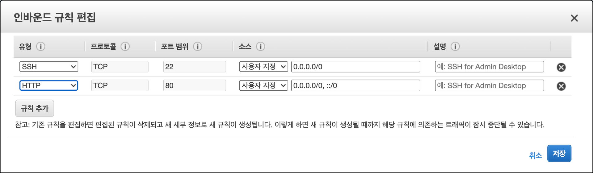
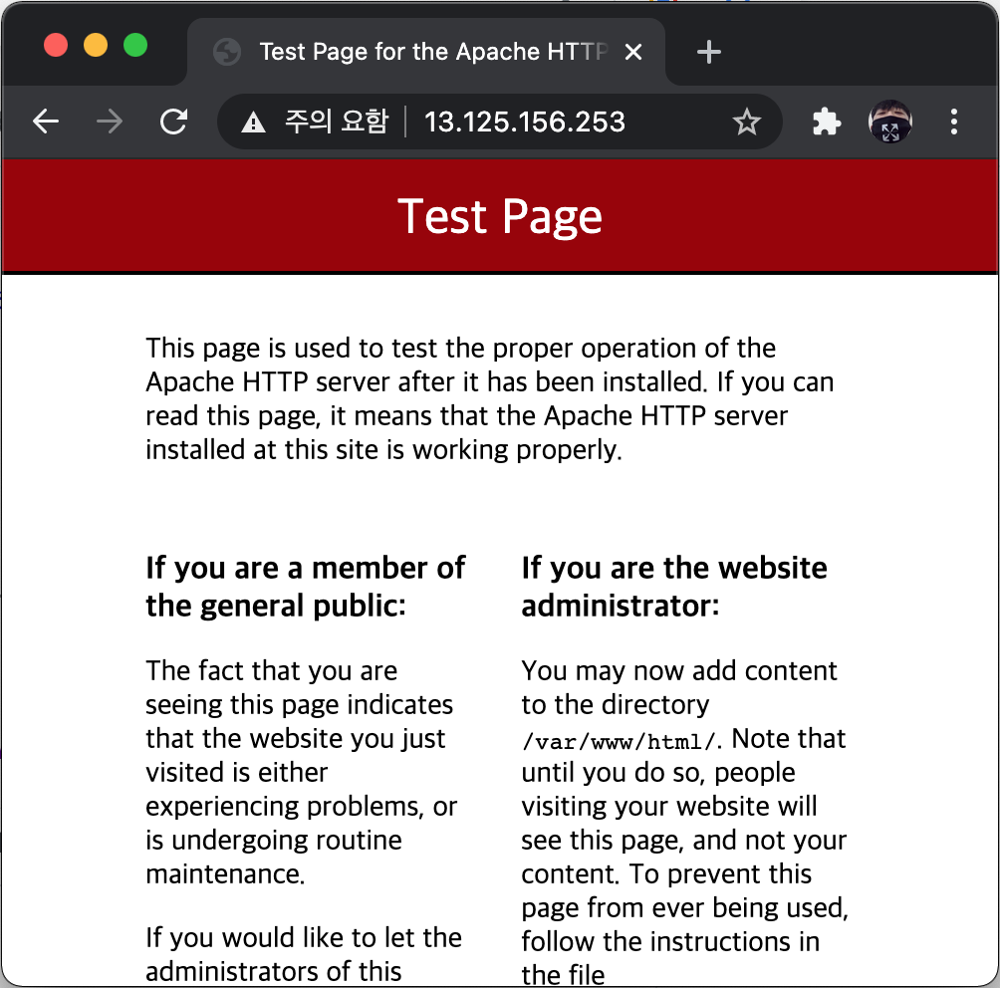
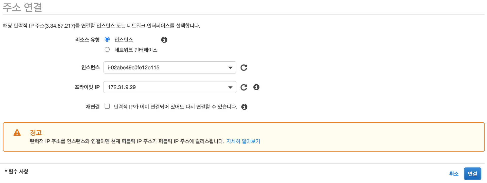
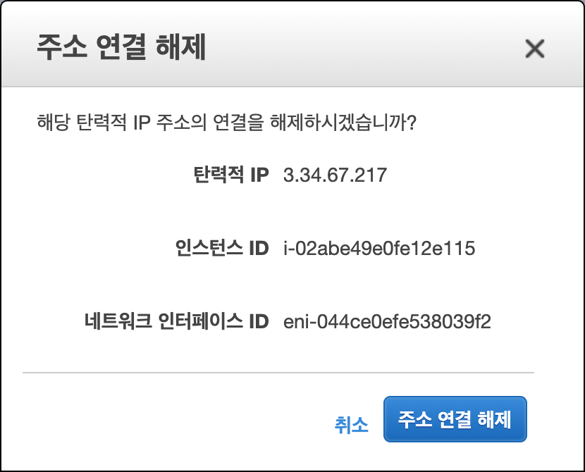
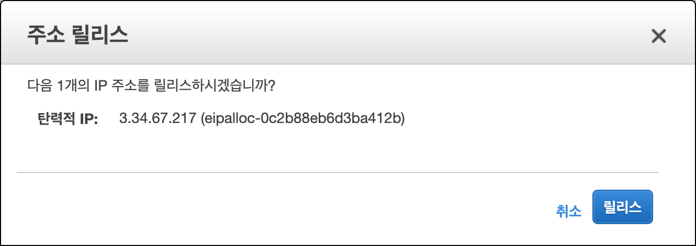

04. Network Configuration

## 04\. 네트워크 설정

### 01\. 공인 IP 주소 할당
​ 가상 서버는 자동으로 공인 IP 주소가 할당되고 그 주소로 접속할 수 있다. 하지만 가상 서버를 시작하거나 정지할 때 마다 공인 IP 주소가 변경된다. 가상 서버로 실제 서비스를 하려면 고정 공인 IP 주소가 필요하다. AWS의 '일래스틱(Elastic) IP 주소' 서비스를 사용하면 고정 공인 IP 주소를 할당할 수 있다. 다음 단계로 고정 공인 IP 주소를 할당하고 연결할 수 있다.

#### 01\. 가상 서버에 웹 서버 시작하기
​ 고정 공인 IP 주소 할당과 가상 서버 연결 실습을 위해 가상 서버 인스턴스에 웹 서버를 설치하고 구동 시킨다.

01. SSH로 접속하여 다음 명령으로 간단하게 설치하고 구동 시킬 수 있다.

	```shell
	[ec2-user@ip-172-31-9-29 ~]$ sudo yum install httpd -y
	Loaded plugins: extras_suggestions, langpacks, priorities, update-motd
	Resolving Dependencies
	[...]
	Complete!
	[ec2-user@ip-172-31-9-29 ~]$ sudo service httpd start
	Redirecting to /bin/systemctl start httpd.service
	[ec2-user@ip-172-31-9-29 ~]$ ps -ef | grep httpd
	root      3433     1  0 06:35 ?        00:00:00 /usr/sbin/httpd -DFOREGROUND
	apache    3434  3433  0 06:35 ?        00:00:00 /usr/sbin/httpd -DFOREGROUND
	apache    3435  3433  0 06:35 ?        00:00:00 /usr/sbin/httpd -DFOREGROUND
	apache    3436  3433  0 06:35 ?        00:00:00 /usr/sbin/httpd -DFOREGROUND
	apache    3437  3433  0 06:35 ?        00:00:00 /usr/sbin/httpd -DFOREGROUND
	apache    3438  3433  0 06:35 ?        00:00:00 /usr/sbin/httpd -DFOREGROUND
	ec2-user  3482  3316  0 06:35 pts/0    00:00:00 grep --color=auto httpd
	```

02. 보안 그룹(Security Group)에서 방화벽 설정을 통해 HTTP(80)으로 어디서나 접근 가능하도록 한다.    
    01. EC2 대시보드(Dashboard) 화면의 '보안 그룹(Security Group)'' 메뉴를 선택
    02. 가상 서버 인스턴스의 보안 그룹을 선택한다.
    03. '인바운드(Inbound)'' 탭을 선택하고 편집(Edit) 버튼을 클릭한다.
    04. 인바운드 규칙 편집 창에서 '규칙 추가(Add Rule)' 를 누르고 HTTP 유형(type)을 선택하고 저장한다.
        
		
03. 브라우저에서 가상 서버 공인 IP를 입력하고 접근해보자
    
    
#### 02\. 고정 공인 IP 주소 할당 받기
01. EC2 대시보드(Dashboard) 화면애서 '탄력적 IP(Elastic IPs)' 메뉴를 선택한다.
02. '새 주소 할당(Allocate new address'를 클릭하여 공인 IP 주소를 할당한다.
	

#### 3\. 가상 서버에 IP 주소 연결 하기
​ 고정 공인 IP를 할당 받았으면 가상 서버와 연결하는 일만 남았다. 다음 순서로 연결한다.

01. EC2 대시보드(Dashboard) 화면애서 '탄력적 IP(Elastic IPs)' 메뉴를 선택한다.
02. 할당 받은 IP를 선택하고 '작업(Actions)' > '주소연결(Associate address)'를 선택한다.
03. '인스턴스(Instance)' 필드에 연결할 가상 서버 인스턴스를 선택한다.
04. 선택한 가상 서버의 프라이빗(private) IP를 선택한다.
05. 연결(Associte) 버튼을 클릭한다.
	

​ 이전에 받았던 공인 IP는 사라지고 방금 연결한 고정 공인 IP가 인스턴스에 세팅된다. 지금부터는 이 고정 공인 IP로 접근이 가능하다. 브라우저로 접근하여 보자. 가상 서버를 중지 시켰다가 다시 시작해도 고정 공인 IP로 접근이 가능한 것을 확인할 수 있다.


​ 고정 IP 주소는 실제 서비스를 운용할 때 반드시 사용해야 하지만 클라우드 인프라 측면에서도 유용한 경우가 많다. 예를 들어, 운용중인 가상 서버를 교체해야하는 경우이다. 실행중인 가상 서버를 고정 IP에 연결하고 운용 중에 새 인스턴스를 준비하고 필요한 모든 애플리케이션을 설치한 후 고정 IP를 새 인스턴스에 연결만 하면 교체를 쉽게 할 수 있다.
​ 사용하지 않는 탄력적 IP 주소에 대해서 AWS는 비용을 청구하고 있다. 탄력적 IP 주소 하나가 실행 중인 EC2 인스턴스에 연결되어 있지 않은 경우 비용을 청구하고 있기 때문에 가상 서버를 중지하거나 종료한 경우에는 할당받은 탄력적 IP 주소를 릴리즈(Release)하여야 한다. 릴리즈 전에는 가상 서버와의 연결부터 해제해야 한다.
01. '작업(Actions)' > '주소 연결 해제(Disassociate Address)'
    
    
02. '작업(Actions)' > '주소 해제(Release Address)'
    
    

### 02\. 네트워크 인터페이스(NIC) 추가하기