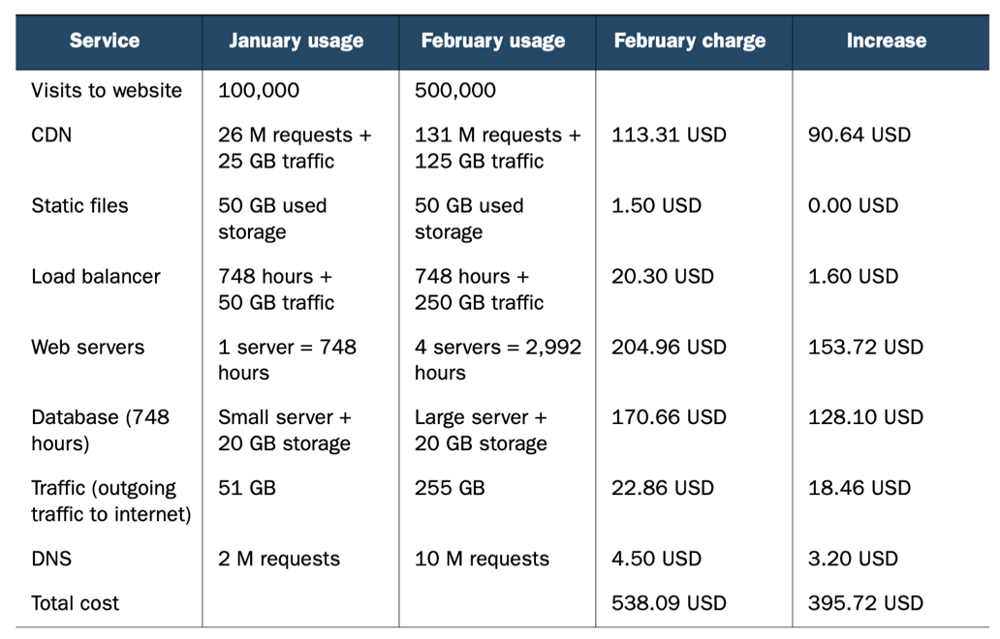

05. AWS Costs

## 05\. AWS 비용
AWS의 요금은 전기, 가스 요금과 유사하다. AWS 서비스 사용량에 따라 청구된다. 가상 서버의 실행 시간, 스토리지의 사용량(GB 단위), 로드 밸런서의 갯수 단위로 청구된다. 각 서비스의 비용은 웹으로 확인 가능하다. 구축할 인프라에 대한 월별 예상 비용은 AWS 월별 비용 계산기(http://aws.amazon.com/calculator) 에서 확인이 가능하다.

### 01. 요금 청구 기준
사용자는 여러 가지 방법으로 요금을 청구 받게 된다. AWS의 세 가지 요금 청구 기준이다. 
1. 사용 시간
   사용 시간이 기준이 되어 청구된다. 예를 들어 EC2 가상 서버는 한달(750시간) 기준으로 요금이 청구된다. 
2. 트래픽 기준
   트래픽은 기가바이트 단위 또는 요청 수로 측정한다.	
4. 스토리지 사용량
   사용량은 스토리지 크기이다. 얼마나 사용했는 지 상관없이 50GB 용량당 또는 실제 사용량을 기준으로 하기도 한다. 

### 02. 요금 청구 예
앞의 예로 들었던 인터넷 쇼핑몰 요금 청구 예를 들어 보면,
#### 01. 인프라 구성도

#### 02. 비용 청구
서비스 별로 비용이 청구되는 기준을 보면,
1. 사용 시간당 과금
   로드 밸런서(ELB), 웹서버(EC2), 데이터베이스(RDS)
2. 트래픽당 과금
   로드 밸런서(ELB), DNS(Route53), CDN(CloudFront), 객체 스토리지(S3)
3. 스토리지 사용량당 과금
   객체 스토리지(S3)

#### 03. 비용 청구 예
1월에 인터넷 쇼핑몰을 운영 시작하였고 2월에 마케팅 결과 좋아서 2월에 방문자가 5배 늘어났다고 가정하자.

비용을 분석해 보면,
1. 방문자는 100,000 명에서 200,000 명 증가하였다.
2. 월 청구액은 142.37 달러에서 538.09 달러로 3배정도 증가하였다.
3. 트래픽의 증가로 CDN, 웹서버, 데이터베이스 등의 서비스에 비용이 증가하였다.
4. 정적 파일 스토리지는 더 많이 사용되지 않았기 때문에 비용 증가가 없다. 

AWS를 사용하면 트랙픽과 비용은 선형관계임을 알 수 있다. AWS의 사용량 기반의 과금(PPU, Pay per Use) 방식은 사용자에게 다음과 기회를 제공한다.
1. 인프라에 대한 선행 투자를 하지 않아도 된다. 필요에 따라 서버를 시작하고 사용한 만큼 지불한다. 해당 서버를 중지하면 더 이상 지불하지 않아도 된다.
2. 저장 공간도 미리 약속할 필요가 없다.
3. 같은 용량이라면 대형 서버 한 대나 소형 서버 여러 대의 비용은 동일하다. 이는 서버를 작게 열러 대로 분산할 기회를 제공하며 예산이 작은 기업에서도 장애 허용 시스템을 구성할 수 있게 해준다.

전반적으로 유연하게 인프라 아키텍처를 설계하고 구축하고 운영하며 변경이 가능하게 해준다.

### 03. 프리 티어(Free Tier)