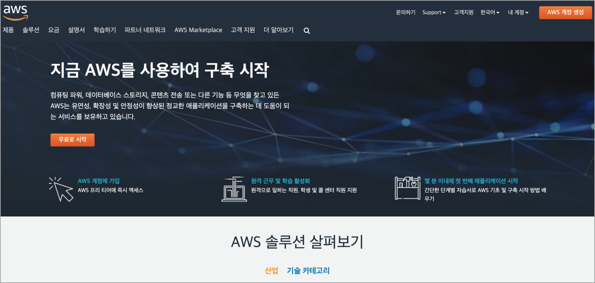
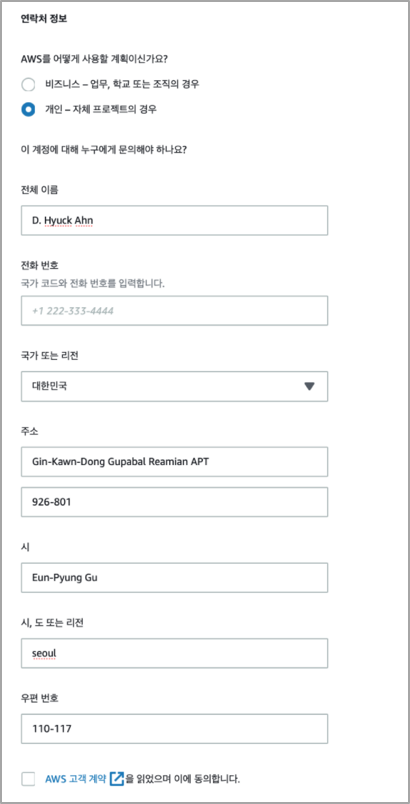

02. AWS 계정 생성(가입)

## 02. AWS 계정 생성(가입)
​ AWS 계정이 프리 티어 기간이 만료 되었거나 처음 AWS를 사용하면, 다음 과정을 참고하여 새 계정을 생성(가입)한다.

### 01. 계정 생성을 위해 필요한 것
- 신원 확인을 위한 전화번호
- 요금을 청구할 신용카드

### 02. 가입 절차
​ AWS 계정을 생성하기 위한 절차는 다음 5단계 이다.

01. 로그인 자격 증명 제공
02. 연락처 정보 제공
03. 결제 세부 정보 제공
04. 자격 증명 확인
05. 지원 계획(Support Plan) 선택 

### 03. 계정 생성하기
​ AWS 홈페이지(https://aws.amazon.com/ko/) 이동 한 후, 'AWS 계정 생성', '무료로 시작' 버튼을 눌러 가입을 시작한다.

    
#### 1. 로그인 자격 증명 제공

- 이메일 주소, 비밀번호, 계정 이름 입력
- 계속 버튼을 눌러 다음 단계 진행

#### 2. 연락처 정보 제공

- 연락처 정보를 영문으로 모두 기입하여야 한다.
- 계속 버튼을 눌러 다음 단계 진행

#### 3. 결제 정보 입력

확인 및 계속 버튼을 눌러 다음 단계를 진행
    
#### 4. 자격 증명 확인

- SMS 전송과 음성 통화를 통해 본인 인증을 진행할 수 있다.
- SMS로 전달 받은 Code를 입력하고 계속을 눌러 마지막 단계를 진행 한다.

#### 5. 지원 계획 선택

- 기본 지원(무료)를 선택한다.
- 가입 완료 버튼을 눌러 가입을 완료한다.
    
#### 6. 가입 완료

