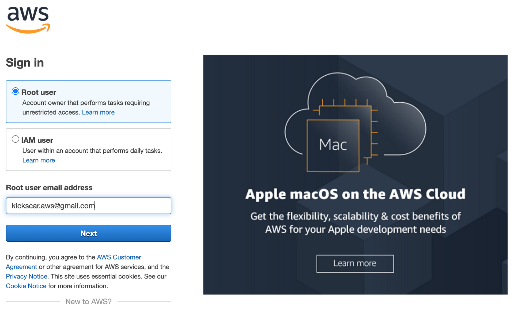
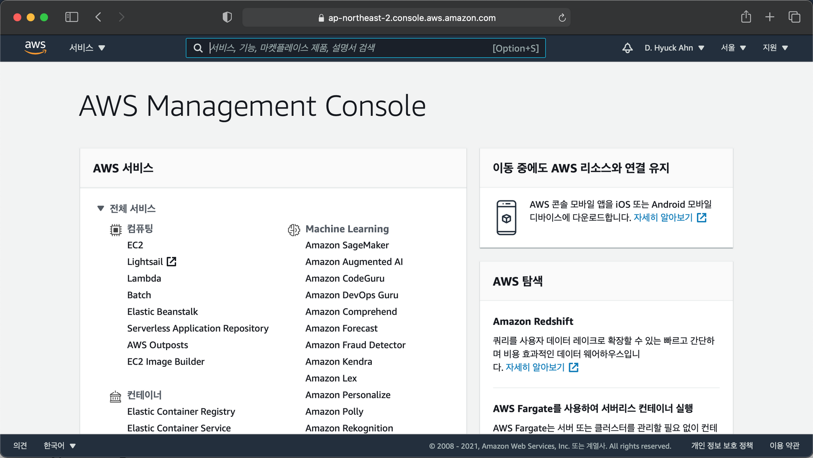
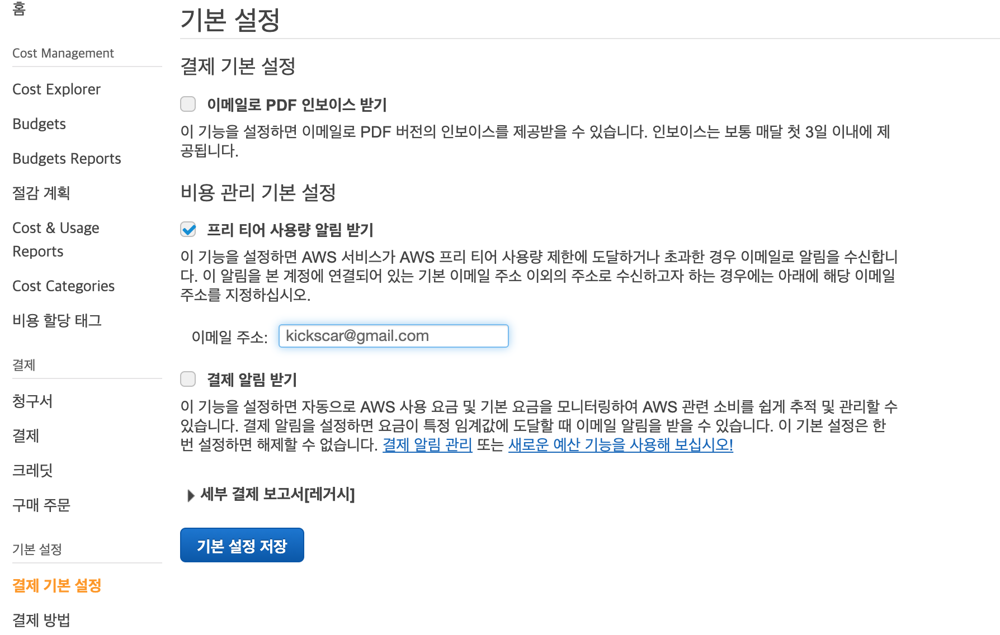

03. AWS 관리 콘솔 로그인

## 03\. AWS 관리 콘솔 로그인

​ https://console.aws.amazon.com/ 에서 AWS 관리 콘솔에 로그인 할 수 있다.

### 01\. 로그인 하기

1.  계정 ID 입력
    
    
2.  비밀번호 입력
    
    

### 02\. AWS 관리 콘솔

### 03\. 요금 청구 알람 생성

​ 새로 생성한 계정으로 앞으로의 실습하기 전에 청구 경보(billing alarm)을 만들어 두는 것을 추천한다. 청구 경보는 프리 티어를 벗어날 때 이메일을 보내준다. 실습을 마친 후 클린업을 하겠지만 실수로 빠트린 경우을 대비하여 청구 경보를 만들어 두는 것이 좋다.

1.  대금 및 비용 관리 대시보드(Billing Dashboard)
    https://console.aws.amazon.com/billing 으로 이동한다.    
    
    
2.  프리 티어 사용량 알림 받기(Receive AWS Free Tier Usage Alerts) 설정
    
    
    - '결제 기본 설정'을 선택한다.
    - 프리 티어 사용량 알림 받기(Receive AWS Free Tier Usage Alerts) 체크박스를 체크한다.
    - 알림을 받을 이메일을 입력한다.
    - 기본 설정 저장 버튼을 클릭한다.