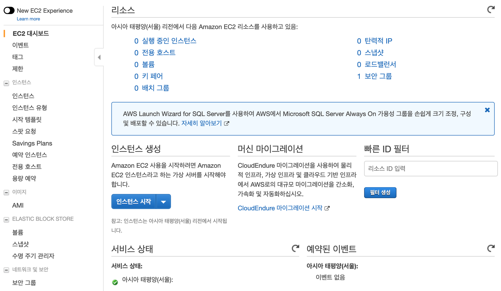
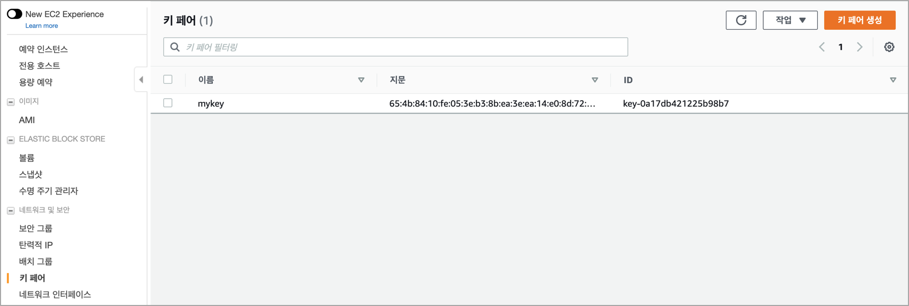
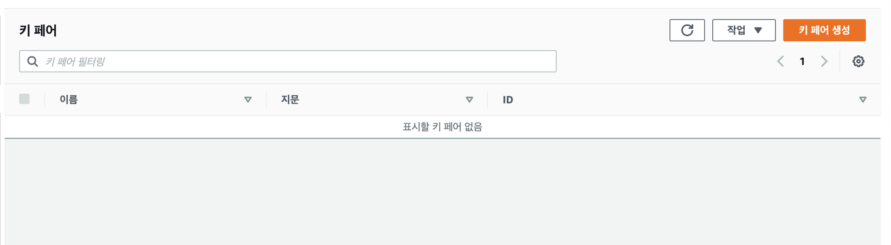
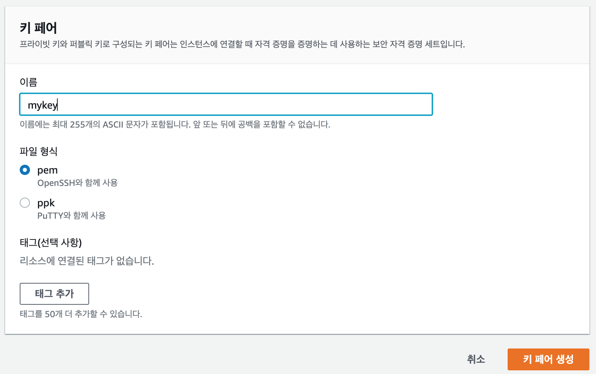

04. Create Key Pair

## 04. 키 페어(Key Pair) 생성

### 01. 키 페어(Key Pair)
AWS EC2(가상 서버)에 접근하기 위해서 SSH 프로토콜 접근을 하게 된다.

SSH 서버는 다양한 방법으로 SSH 클라이언트(보통 터미널 프로그램 Putty, Xshell 등)을 인증할 수 있다.
가장 기본적인 방법은 패스워드를 사용하는 방법이지만 가장 안전하지 못한 방법으로 비록 패스워드는 암호화되어 서버로 보내지지만 꾸준하고 반복적인 해커의 공격(무차별 대입 공격, brute force attack)에 안전할 만큼 복잡하거나 길지 않은 경우가 거의 대부분이다. 컴퓨팅 파워가 비약적으로 발전했기 때문에 자동화 된 스크립트를 사용한  공격에 취약할 수 밖에 없다. 다른 추가적인 보안방식들도 있지만 SSH key 방식이 가장 안정적이고 안전한 검증된 인증방식이다.

키 페어는 public(공개) 키와 private(개인) 키로 이루어지며 AWS 관리 콘솔에서 미리 생성해 두었다가 SSH로 로그인하길 원하는 EC2(가상 서버)에 Public 키를 저장한다. 그리고 클라이언트가 SSH key를 사용해 인증하려고 시도하면, 서버는 클라이언트가 private 키를 가지고 있는지 여부를 테스트 할 수 있다. 클라이언트가 private 키를 가지고 있는걸 증명하면 쉘 세션이 생성된다. 따라서 생성된 키페어의 private 키는 잘 저장하고 절대로 노출되거나 분실하면 안된다.

------------------------------------------------ 

*[참고] 암호화 방식*

1. 대칭키 방식
   암호화(Encryption)과 복호화(Decryption)에 사용하는 키가 같다. 암호화해서 복호화를 해야 하는 상대방에게 키를 전달할 때 키가 노출되는 단점이 있다.
   
2. 공개키 방식
   암호화와 복호화에 사용하는 키가 다르다. 암호화에 사용하는 키를 공개(public)키라 하고 복호화에 사용하는 키를 개인(private)키라 한다.

*SSH key 확인 절차(사용자 인증)*
1. 서버와 접속이 되면 클라이언트는 서버의 공개키를 받아 저장한다.
2. 서버는 난수값을 발생하고 해시값을 만들어 저장한다.
3. 서버는 난수값을 공개키로 암호화하여 클라이언트에 전송한다.
4. 클라이언트는 서버로 부터 전달받은 암호화된 난수값을 개인키로 복호화 한다.
5. 클라이언트는 복호화된 데이터로 해시값을 만들어 서버로 전송한다.
6. 서버는 저장된 해시값과 클라이언트로 부터 전달받은 해시값을 비교하여 정상적인 사용자인지 인증하게 된다.

이 두 개의 키를 생성하는 알고리즘으로 RSA 공개키 알고리즘을 주로 사용한다.

----------------------------------------------

### 02. 키페어(Key Pair) 생성하기
01. 'EC2 대시보드(Dashboard)'로 이동
	

02. '네트워크 및 보안(Network & Security) > 키 페어(Key Pair)' 메뉴를 선택한다.
	

03. 키 페어 생성(Create Key Pair) 버튼 클릭
	

04. 키 페어 생성
	

05. 성공적으로 생성된 모습
	

다운 받은 mykey.pem를 잘 보관해 두어야 한다. 
*ch03. 가상 서버: EC2* 에서 SSH 클라이언트가 가상 서버에 접속할 때 사용한다.
