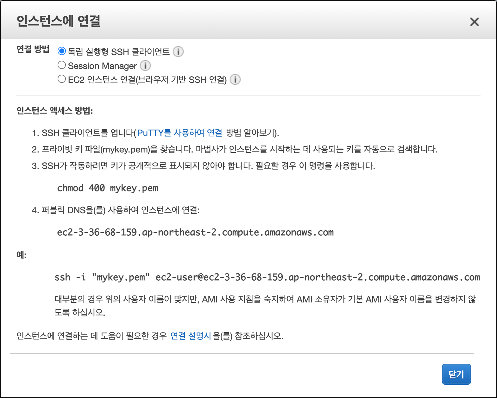
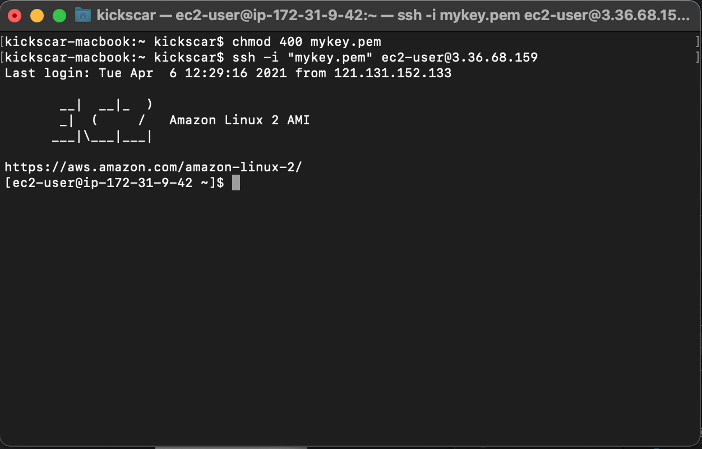
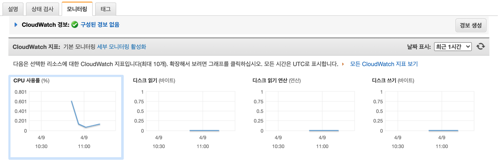
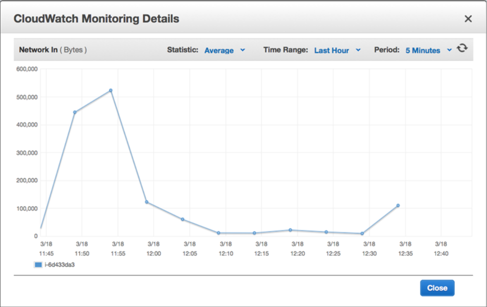
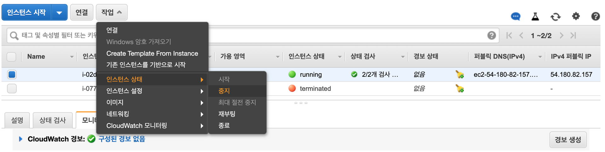

03.  Virtual Server Operation

## 03\. 가상 서버 운영

### 01\. 서버 접속
​ EC2 대시보드의 인스턴스 메뉴에서 인스턴스 목록에서 인스턴스를 선택하고 연결(Connect) 버튼을 클릭하면 '인스턴스 연결' 연결 지침을 볼 수 있다.

​ 독립 실행형 SSH 클라이언트, Session Manager, EC2 인스턴스 연결(브라우저 기반 SSH 연결) 세 가지 방법을 안내하고 있다. 실습에서는 원격 서버에 접속의 가장 일반적인 방법인 SSH 클라이언트로 접속하는 방법으로 실습한다.

#### 01\. Mac OS 또는 Linux
​ mykey.pem 파일의 경로와 가상 서버 공인 IP를  확인하고 다음 명령으로 접속 계정(ec2-user)로 가상 서버에 접속해 보자
```shell
	# chmod 400 mykey.pem
	# ssh -i "mykey.pem" ec2-user@3.36.68.159
```
​ 접속에 성공한 화면이다.
 

#### 02\. Windows


### 02\. 서버 모니터링
​ AWS는 가상 서버를 모니터링 또는 디버깅 할 수 있는 도구로 로그 보기와 부하 모니터링과 같은 도구를 제공하고 있다.

#### 01\. 가상 서버 로그
​ EC2 관리 콘솔에서 가상 서버 로그를 볼 수 있다. 가상 서버 로그를 통해서 가상 서버가 시작할 때 문제점 그리고 가상 서버가 계속 가동 중일 때 하고 있는 것들을 모니터링 할 수 있다.


01. EC2 대시보드(Dashboard) 화면의 인스턴스(Instance) 메뉴를 선택
02. 인스턴스 목록에서 실행(running) 상태의 인스턴스를 선택한다.
03. '작업(Actions)' 메뉴에서 '인스턴스 설정(Instance Settings)' > '시스템 로그 가져오기(Get System Log)'를 선택한다.


​ SSH로 서버에 직접 접근하지 않고 서버의 시스템 로그에 접근할 수 있는 간단하고 효율적인 방법이다. 경우에 따라서는 몇 분 정도 소요될 수 있다.

##### 02\. 가상 서버 부하 모니터링
​ 가상 서버의 CPU, 네트워크, 디스크 등과 같은 자원들의 사용량에 대한 지표(metrics)를 모니터링 할 수 있다. 


01. EC2 대시보드(Dashboard) 화면의 인스턴스(Instance) 메뉴를 선택
02. 인스턴스 목록에서 실행(running) 상태의 인스턴스를 선택한다.
03. 아래의 '모니터링(Monitoring)' 탭을 선택한다.

​ 각 지표 차트의 세부 사항을 확인하기 위해서는 차트를 클릭한다. 메모리에 대한 지표만 빼고 CPU, 네트워크, 디스크 의 사용량에 대한 지표가 있다. 기본 모니터링은 5분마다 갱신되며 상세 모니터링은 1분마다 갱신되지만 비용이 발생한다.



### 03\. 서버 상태
​ 가상 서버의 상태는 다음과 같은 5가지 상태가 있으며 사용자는 제어를 할 수 있다. 비용과 관련된 부분이기 때문에 정확하게 가상 서버의 상태들의 의미를 알고 있어야 한다.
01. 시작(Start) 
	중지(Stop) 상태의 가상 서버는 언제든지 시작(Start)될 수 있다.
02. 중지(Stop)
	실행 중인 가상 서버는 언제든지 중지(Stop) 할 수 있다. 중지된 가상 서버는 비용이 청구되지 않으며 다시 시작 할 수 있다. 네트워크에 연결된 스토리지 데이터는 그대로 남아 있기 때문에 비용은 청구된다.  
03. 최대 절전 중지(Hibernation, 또는 수면 모드)
	현재 서버의 상태를 루트 EBS 볼륨에 있는 파일에 저장된 다음 실질적으로 인스턴스가 중지되었다가 재 시작시 그 시점을 복원한다. 비용은 연결된 EBS 볼륨과 일래스틱 IP 주소에 대한 요금만 지불되며 가상 서버 인스턴스에 대한 비용은 청구되지 않는다.	
04. 재부팅(Reboot)
	서버를 재부팅 해야 하는 경우에 서버를 다시 중지했다가 시작할 수 있다. 당연히 재부팅된 서버의 데이터는 그대로 보존된다.
05. 종료(Terminate)
	종료는 가상 서버 인스턴스의 삭제를 의미한다. 이미 종료된 가상 서버는 다시 시작할 수 없으며 네트워크 연결 스토리지와 IP 주소와 같은 모든 종속성도 사라진다. 종료된 가상 서버는 비용이 부과되지 않는다.
   
​ 가상 서버의 상태의 중지(Stop)과 종료(Terminate)의 차이점을 이해해야 하며 가상 서버의 상태 제어는 다음과 같이 제어할 수 있다.


01. EC2 대시보드(Dashboard) 화면의 인스턴스(Instance) 메뉴를 선택
02. 인스턴스 목록에서 실행(running) 상태의 인스턴스를 선택한다.
03. '작업(Actions)' 메뉴에서 '인스턴스 상태(Instance Status)' 에서 각 상태를 선택한다.


### 04\. 서버 크기 변경
​ 가상 서버의 크기(CPU 갯수, 하드 디스크의 사이즈, 메모리 사이즈 등)은 언제든지 변경이 가능하다. 이는 클라우드가 반드시 제공해야 하는 기능이고 클라우드의 장점이기도 하다. 클라우드 기반의 서비스를 제공하다가 더 강력한 컴퓨팅 파워가 필요하면 서버의 크기를 변경해야 한다. 다음 순서로 서버 크기를 확인하면서 서버 크기를 변경해 보자.

01. 현재 실행 중인 서버 크기 확인한다.

	```shell
	[ec2-user@ip-172-31-36-57 ~]$ cat /proc/cpuinfo
	processor	: 0
	vendor_id	: GenuineIntel
	cpu family	: 6
	model		: 63
	model name	: Intel(R) Xeon(R) CPU E5-2676 v3 @ 2.40GHz
	stepping	: 2
	microcode	: 0x44
	cpu MHz		: 2399.968
	cache size	: 30720 KB
	physical id	: 0
	siblings	: 1
	core id		: 0
	[...]

	[ec2-user@ip-172-31-36-57 ~]$ free -m
				  total        used        free      shared  buff/cache   available
	Mem:            983          90         427           0         465         750
	Swap:             0           0           0
	```
	
	현재 가상 서버의 크기를 확인해 보면 CPU 하나에 메모리는 983M 이다. 

02. 다음과 같은 순서로 가상 서버의 크기를 변경한다.   
    01. 실행 중인 가상 서버 중지(Stop) 한다.
    02. '작업(Actions)' 메뉴에서 '인스턴스 설정(Instance Settings)' > '인스턴스 유형 변경(Change Instance Type)'를 선택한다.
    03. 인스턴스 유형을 'm4.large' 로 변경한다.
        
    04. 변경 되었다. 다시 가상 서버를 시작한다.

03. 가상 서버는 다시 시작하면 IP가 변경되기 때문에 변경된 IP를 확인하고 새로 시작된 가상 서버에 접속한다.
04. 서버에 접속하여 변경 전 서버 크기를 확인했던 명령어로 변경된 서버 크기를 확인해 보자.
	```shell
	[ec2-user@ip-172-31-36-57 ~]$ cat /proc/cpuinfo
	processor	: 0
	vendor_id	: GenuineIntel
	cpu family	: 6
	model		: 79
	model name	: Intel(R) Xeon(R) CPU E5-2686 v4 @ 2.30GHz
	stepping	: 1
	microcode	: 0xb000038
	cpu MHz		: 2300.130
	cache size	: 46080 KB
	physical id	: 0
	siblings	: 2
	core id		: 0
	[...]

	processor	: 1
	vendor_id	: GenuineIntel
	cpu family	: 6
	model		: 79
	model name	: Intel(R) Xeon(R) CPU E5-2686 v4 @ 2.30GHz
	stepping	: 1
	microcode	: 0xb000038
	cpu MHz		: 2300.130
	cache size	: 46080 KB
	physical id	: 0
	siblings	: 2
	core id		: 0
	[...]

	[ec2-user@ip-172-31-36-57 ~]$ free -m
				  total        used        free      shared  buff/cache   available
	Mem:           7974          97        7687           0         189        7654
	Swap:             0           0           0
	```
	
	가상 서버 유형 변경 후, CPU 두 개에 7974M 사이즈의 메모리로 변경된 것을 확인 할 수 있다.
